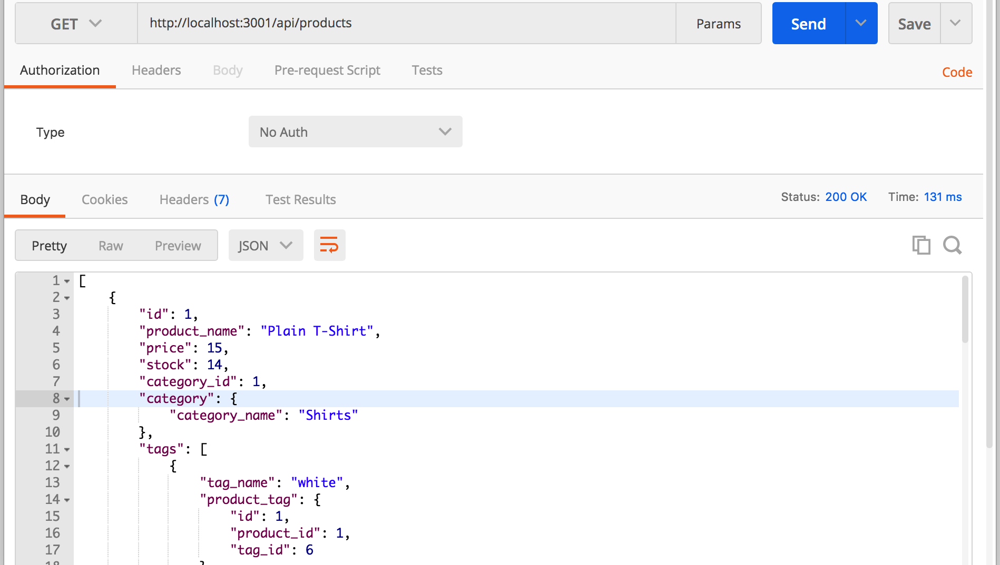
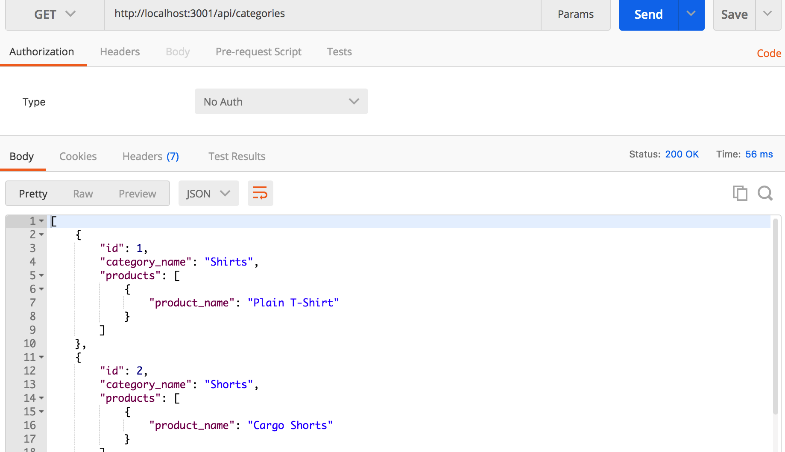
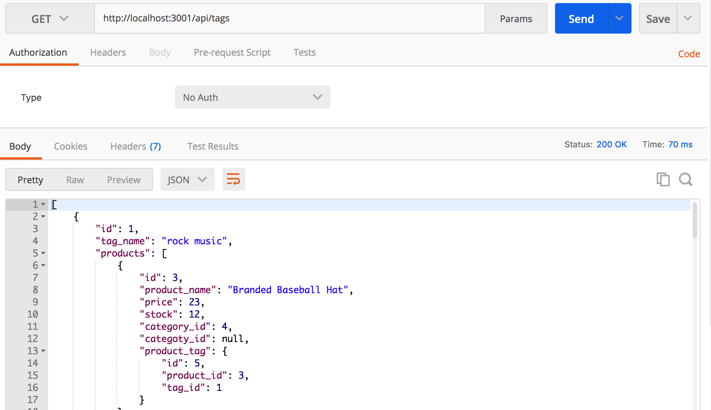

# Buy N Large Corp Back End
Challenge: Build a back end for an e-commerce site for fictional store BuyNLarge to store basic categorical data for inventory

## User Story

```md
AS A manager at an internet retail company
I WANT a back end for my e-commerce website that uses the latest technologies
SO THAT my company can compete with other e-commerce companies
```

## Installations
* Express
* Node
* Sequelize
* MySQl
* dotenv

## Data base models
* Product
* Category
* Tags
* Product Tags

## Acceptance Criteria

```md
GIVEN a functional Express.js API
WHEN I add my database name, MySQL username, and MySQL password to an environment variable file
THEN I am able to connect to a database using Sequelize
WHEN I enter schema and seed commands
THEN a development database is created and is seeded with test data
WHEN I enter the command to invoke the application
THEN my server is started and the Sequelize models are synced to the MySQL database
WHEN I open API GET routes in Insomnia Core for categories, products, or tags
THEN the data for each of these routes is displayed in a formatted JSON
WHEN I test API POST, PUT, and DELETE routes in Insomnia Core
THEN I am able to successfully create, update, and delete data in my database
```

## Usage




## Demo Video

[WATCH DEMO](https://drive.google.com/file/d/1Ga5pM12E1OZs9CeSy40L9hRve6DD0CHy/view)

